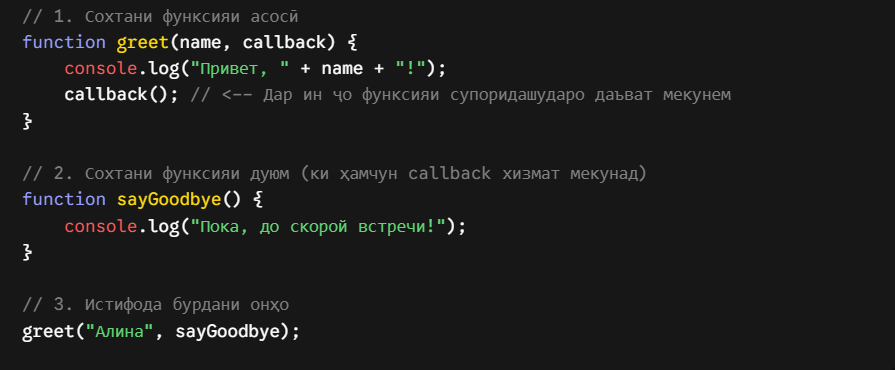
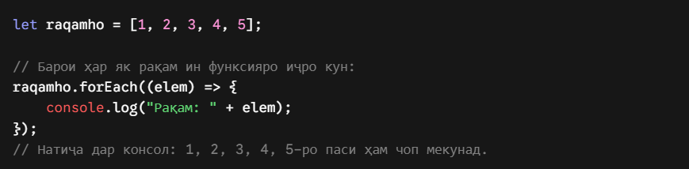
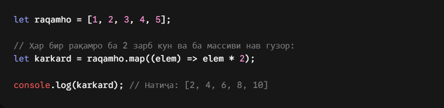

# callbacks

Хулосаи оддӣ: Callback чист?
Callback (Тарҷумааш: Занги ҷавобӣ) — ин функсияест, ки мо онро ҳамчун як "аргумент" (мисли рақам ё матни оддӣ) ба даруни функсияи дигар месупорем, то ки он функсия корҳояшро иҷро карда тамом кунад ва баъд аз ин функсияи моро даъват (вызов) кунад.

# forEach()

forEach()
Чист: Ин метод танҳо аз болои ҳар як унсури массив ба навбат мегузарад (мисли сикли for). Вай ягон массиви нав намесозад, танҳо вазифаеро, ки додед, иҷро мекунад.

# map()

map()
Чист: Ин метод ҳамаи унсурҳоро гирифта, онҳоро тағйир медиҳад ва як массиви нави тағйирёфта месозад. Массиви аввала бетағйир мемонад.

