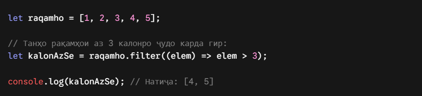
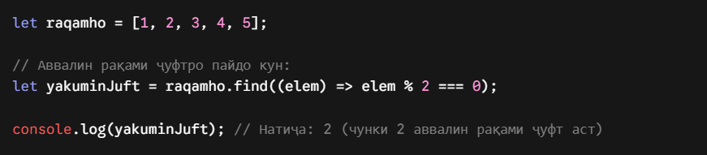
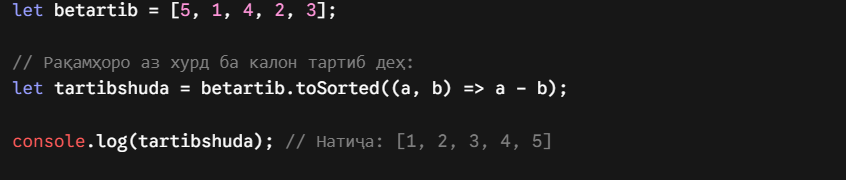
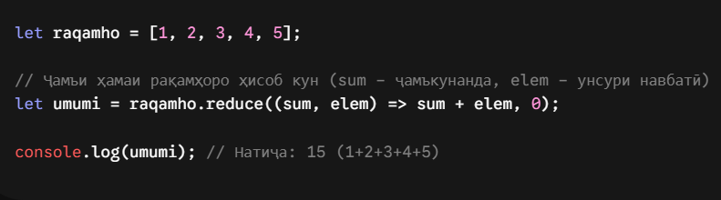
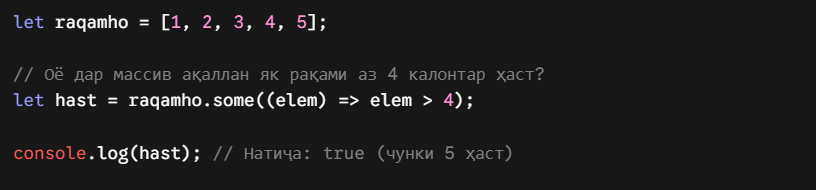
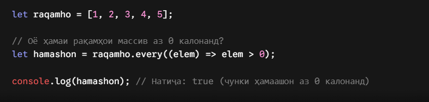

# callbacks

Хулосаи оддӣ: Callback чист?
Callback (Тарҷумааш: Занги ҷавобӣ) — ин функсияест, ки мо онро ҳамчун як "аргумент" (мисли рақам ё матни оддӣ) ба даруни функсияи дигар месупорем, то ки он функсия корҳояшро иҷро карда тамом кунад ва баъд аз ин функсияи моро даъват (вызов) кунад.

# forEach()

forEach()
Чист: Ин метод танҳо аз болои ҳар як унсури массив ба навбат мегузарад (мисли сикли for). Вай ягон массиви нав намесозад, танҳо вазифаеро, ки додед, иҷро мекунад.

# map()

map()
Чист: Ин метод ҳамаи унсурҳоро гирифта, онҳоро тағйир медиҳад ва як массиви нави тағйирёфта месозад. Массиви аввала бетағйир мемонад.

# filter()

filter()
Чист: Ин метод массивро "элак" (филтр) мекунад. Танҳо он унсурҳое, ки ба шарти мо рост меоянд, ба массиви нав гузаронда мешаванд.

# find()
Чист: Ин метод массивро мекобад ва танҳо аввалин унсуреро, ки ба шарт рост омад, бармегардонад. Массив намесозад, танҳо худи унсурро медиҳад.

# toSorted()

toSorted()
Чист: Ин метод унсурҳоро тартиб медиҳад (сортировка мекунад) ва як массиви нави тартибшуда бармегардонад. Массиви аввалаамон вайрон намешавад.

# reduce()
reduce()
Чист: Ин метод вазифаи "ҷамъбасткунӣ"-ро дорад. Вай ҳамаи унсурҳоро коркард карда, ба як дона рақам ё матн табдил медиҳад (масалан, барои ҳисоб кардани умумии нархҳо).

# some()

some()
Чист: Ин метод месанҷад, ки ақаллан як унсури массив ба шарти мо рост меояд ё не. Ҷавобаш танҳо true (ҳа) ё false (не) мешавад.

# every()
every()
Чист: Ин метод месанҷад, ки ҳамаи унсурҳои массив бе истисно ба шарт рост меоянд ё не. Танҳо вақте true медиҳад, ки ҳамааш рост ояд.

